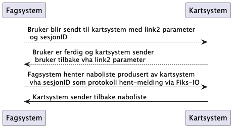
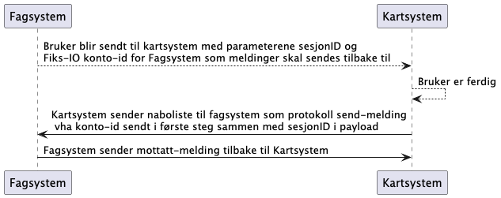

# Sekvensdiagram

## Basert på GI Link metoden

Dette viser slik sekvensen er når man bruker metoden fra GI Link.

Da vil bruker bli sendt fra Fagsystem til Kartsystem i nettleser. I url til Kartsystem er parameteren sesjonID og link2.

Parameteren sesjonID brukes for å identifisere det som produseres i Kartsystem (f.eks. naboliste) og brukes da når Fagsystem skal hente data.

Parameteren link2 henviser til url for Fagsystem brukeren skal sendes tilbake til fra Kartsystem. Denne url'en vil da gjøre at brukeren treffer Fagsystem som signaliserer at Fagsystem skal hente data fra Kartsystem som en Fiks Protokoll melding.  

## Basert på alternativ Fiks Link metode

Dette viser slik sekvensen kan blir hvis man bruker ny metode som forslag for Fiks Link.

Da vil bruker bli sendt fra Fagsystem til Kartsystem i nettleser. I url til Kartsystem er parameteren sesjonID og Fiks IO kontoid.
Fiks IO kontoid er da kontoid til Kartsystem. De to systemene har allerede etablert kontakt gjennom Fiks Protokoll og tillat å sende meldinger til hverandre. 

Parameteren sesjonID brukes for å identifisere det som produseres i Kartsystem (f.eks. naboliste) og brukes da når Fagsystem mottar data.

Når bruker er ferdig å jobbe i Kartsystem så vil Kartsystem sende det som er produsert (nabolisten) til Fagsystem som Fiks Protokoll melding, med sesjonID i payload.

