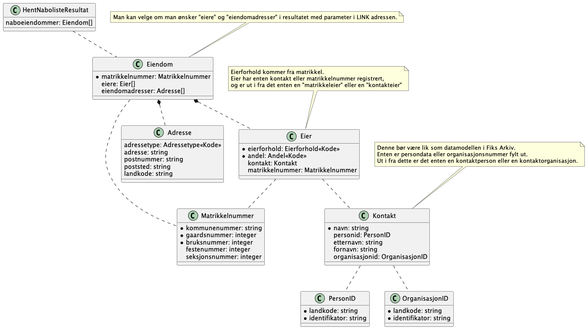

#  Kontrakter og dokumentasjon for Fiks Link
Dette er en fornyelse av GI Link vha blant annet Fiks Protokoll.

Link består av lenker som skal støttes av systemet som støtter Link.
Disse lenkene er webbaserte applikasjoner som klient-systemet kan bruke for f.eks. hente en naboliste basert på kartutsnitt. Så kan klienten hente listen etterpå via en tjeneste, som blir en Fiks Protokoll tjeneste. 

Link består altså av definerte lenker til systemet som fører til applikasjon som produserer noe, og tilhørende tjenester for å hente det applikasjonen produserte.  

## GI Link
https://geointegrasjon.no/link/

### GI Link UML
Hentet fra dokumentasjonen til GI Link:

## Fiks Link

_UNDER ARBEID_

Dette er utkast og under arbeid.

### Linker
Foreløpig henviser vi til GI Link dokumentasjonen. Mer informasjon kommer her etter hvert.
Men burde vi modernisert spesifikasjonen av lenkene til f.eks. en OpenAPI Spec?

### Meldingstyper og skjema

Json schemas er forsøkt modellert etter UML diagrammer fra GI Link, men med endringer der hvor det har virket fornuftig

#### Meldingstyper / json schemas

- `no.ks.fiks.link.v1.innsyn.dokument.hent.json`
- `no.ks.fiks.link.v1.innsyn.dokument.hent.resultat.json` - Noen endringer i dokument objektet, som i andre protokoller. Det må nok gjøres flere endringer?.
- `no.ks.fiks.link.v1.innsyn.naboliste.hent.json` 
- `no.ks.fiks.link.v1.innsyn.naboliste.hent.resultat.json` - Endringer i struktur / feltnavn fra GI Link****
- `no.ks.fiks.link.v1.innsyn.omraade.hent.json`
- `no.ks.fiks.link.v1.innsyn.omraade.hent.resultat.json` - Returner "flate" slik den er definert i Fiks Plan?
- `no.ks.fiks.link.v1.innsyn.punkt.hent.json`
- `no.ks.fiks.link.v1.innsyn.punkt.hent.resultat.json` - Returnerer "posisjon" slik den er definert i Fiks Plan?

#### Json schemas for datatyper brukt i meldingstypene

- `no.ks.fiks.link.v1.felles.adresse.schema.json` - Bør endres til slik som i Fiks Plan / Fiks Arkiv?
- `no.ks.fiks.link.v1.felles.dokument.schema.json` - Bør endres til slik som i Fiks Plan / Fiks Arkiv?
- `no.ks.fiks.link.v1.felles.eiendom.schema.json` - Bør endres til slik som i Fiks Matrikkelføring?
- `no.ks.fiks.link.v1.felles.eier.schema.json` 
- `no.ks.fiks.link.v1.felles.flate.schema.json` - Kopiert fra Fiks Plan
- `no.ks.fiks.link.v1.felles.kontakt.schema.json`
- `no.ks.fiks.link.v1.felles.kontakteier.schema.json`
- `no.ks.fiks.link.v1.felles.kontaktorganisasjon.schema.json`
- `no.ks.fiks.link.v1.felles.kontaktperson.schema.json`
- `no.ks.fiks.link.v1.felles.matrikkeleier.schema.json`
- `no.ks.fiks.link.v1.felles.matrikkelnummer.schema.json` - Kopiert fra Fiks Plan
- `no.ks.fiks.link.v1.felles.naboeiendom.schema.json` 
- `no.ks.fiks.link.v1.felles.posisjon.schema.json` - Kopiert fra Fiks Plan

### Hent punkt 

**Skjema for meldingstypene:**
- [`no.ks.fiks.link.v1.innsyn.punkt.hent.json`](Schema/V1/no.ks.fiks.link.v1.innsyn.punkt.hent.json)
- [`no.ks.fiks.link.v1.innsyn.punkt.hent.resultat.json`](Schema/V1/no.ks.fiks.link.v1.innsyn.punkt.hent.resultat.json)

##### Resultat

Datastruktur i json-schemas. UML fra GI Link ble brukt som utgangspunkt.

### Hent naboliste

- [`no.ks.fiks.link.v1.innsyn.naboliste.hent.json`](Schema/V1/no.ks.fiks.link.v1.innsyn.naboliste.hent.json)
- [`no.ks.fiks.link.v1.innsyn.naboliste.hent.resultat.json`](Schema/V1/no.ks.fiks.link.v1.innsyn.naboliste.hent.resultat.json) 

##### Resultat

Datastruktur i json-schemas. UML fra GI Link ble brukt som utgangspunkt.

### Hent dokument

**Skjema for meldingstypene:**
- [`no.ks.fiks.link.v1.innsyn.dokument.hent.json`](Schema/V1/no.ks.fiks.link.v1.innsyn.dokument.hent.json)
- [`no.ks.fiks.link.v1.innsyn.dokument.hent.resultat.json`](Schema/V1/no.ks.fiks.link.v1.innsyn.dokument.hent.resultat.json)

##### Hent 

##### Resultat

Datastruktur i json-schemas. UML fra GI Link ble brukt som utgangspunkt sammen med dokument fra Fiks Arkiv

### Hent omraade

**Skjema for meldingstypene:**
- [`no.ks.fiks.link.v1.innsyn.omraade.hent.json`](Schema/V1/no.ks.fiks.link.v1.innsyn.omraade.hent.json)
- [`no.ks.fiks.link.v1.innsyn.omraade.hent.resultat.json`](Schema/V1/no.ks.fiks.link.v1.innsyn.omraade.hent.resultat.json)

##### Hent

##### Resultat

Datastruktur i json-schemas. UML fra GI Link ble brukt som utgangspunkt sammen med dokument fra Fiks Arkiv

