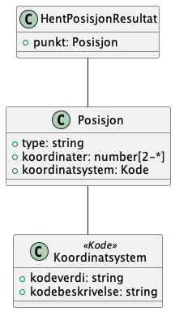
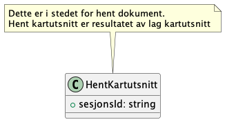
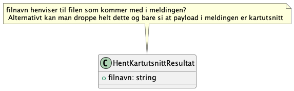
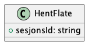
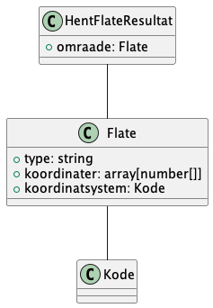

#  Kontrakter og dokumentasjon for Fiks Link
Dette er en fornyelse av GI Link vha blant annet Fiks Protokoll.

Link består av lenker som skal støttes av systemet som støtter Link.
Disse lenkene er webbaserte applikasjoner som klient-systemet kan bruke for f.eks. hente en naboliste basert på kartutsnitt. Så kan klienten hente listen etterpå via en tjeneste, som blir en Fiks Protokoll tjeneste. 

Link består altså av definerte lenker til systemet som fører til applikasjon som produserer noe, og tilhørende tjenester for å hente det applikasjonen produserte.  

## GI Link
https://geointegrasjon.no/link/

### GI Link UML
Hentet fra dokumentasjonen til GI Link:

## Fiks Link

_UNDER ARBEID_

Dette er utkast og under arbeid.

### Linker
Foreløpig henviser vi til GI Link dokumentasjonen. Mer informasjon kommer her etter hvert.
Men burde vi modernisert spesifikasjonen av lenkene til f.eks. en OpenAPI Spec?

Link-tjenestene er tjenestene som enten viser noe eller som faktisk produserer noe i systemet slik at det etterpå kan hentes ved hjelp av en "hent-melding".

Link-tjenestene er som følger fra gammel standard:

#### LagNaboliste - hent naboliste
Lager en naboliste som så kan hentes vha `no.ks.fiks.link.v1.innsyn.naboliste.hent` melding.

Funksjon som aktiverer et annet system slik at brukeren kan etablere en liste over naboer for en gitt eiendom og returnere listen til sitt opprinnelige system.

System A (f.eks. sakssystemet) benytter funksjonen ved å kalle system B (vanligvis GIS) ved å benytte LINK. GIS-systemet åpnes med aktuelle eiendom i kartbildet og med forslag til naboer. Brukeren får kontroll i GIS-systemets funksjonalitet og bestemmer interaktivt hvilke eiendommer som skal inngå i listen. GIS-systemet lager listen og lagrer den lokalt i GIS-systemet. Etter at Sakssystemet får tilbake kontrollen (returadresse oppgitt ved LINK2), kan nabolisten hentes ved meldingen HentNaboliste

En kan benytte alle Vis-funksjoner for å zoome inn i kartet

Man kan velge om man ønsker tilbake `Eier` og `Adresser` i resultatet med parameter i LINK adressen.

Eksempel på LINK:

http://www.system.no/side.html?funksjon=VisEiendom&kommunenummer=0123&gaardsnummer=1&bruksnummer=2&festenummer=0&seksjonsnummer=1&hint=LagNaboliste&sesjon=A12345678901&link2=http://www.systemB.no/naboliste.html?sesjon=A12345678901

#### LagKartutsnitt - hent kartutsnitt
Lager et kartutsnitt som så kan hentes vha `no.ks.fiks.link.v1.innsyn.kartutsnitt.hent` melding. Kartutsnittet kommer i form av et dokument.

Funksjon som aktiverer et annet system slik at brukeren kan få et kartsnitt rundt en gitt eiendom og returnere kartet som et dokument til sitt opprinnelige system.

System A (f.eks. SAK-systemet) benytter funksjonen ved å kommunisere med system B (vanligvis GIS).  GIS-systemet startes som LINK med parametrene som identifiserer aktuelle eiendom. Brukeren får kontroll i GIS-systemets funksjonalitet og bestemmer interaktivt kartutsnittets størrelse. GIS-systemet lager kartet og lagrer det lokalt i GIS-systemet. Etter at Sakssystemet får tilbake kontrollen (returadresse oppgitt ved LINK2), kan kartet hentes ved en melding (HentKartutsnitt)

En kan benytte alle Vis-funksjoner for å zoome inn i kartet

Eksempel på LINK

http://www.system.no/side.html?funksjon=VisPlan&kommunenummer=0123&planidentifikasjon=R0118AP&hint=LagKartutsnitt&sesjon=A12345678901&link2=http://www.systemB.no/kart.html?sesjon=A12345678901

#### LagPunkt - hent posisjon
Lager et punkt (`posisjon`) som så kan hentes vha `no.ks.fiks.link.v1.innsyn.posisjon.hent` melding.
Vi har valgt å bruke det mer korrekte begrepet `posisjon` for datatypen som også brukes i andre protokoller.

Funksjon som aktiverer et GIS system slik at brukeren kan registrere en koordinat i kartbildet og returnere et punktobjekt til sitt opprinnelige system.

System A (f.eks. SAK-systemet) benytter funksjonen ved å kommunisere med system B (vanligvis GIS).  GIS-systemet overtar kontroll gjennom en LINK og brukeren angir et punkt i GIS systemet interaktivt. GIS-systemet lager koordinat lokalt i GIS-systemet. Etter at Sakssystemet får tilbake kontrollen (returadresse oppgitt ved LINK2), kan punktet hentes ved en melding (HentPunkt)

En kan benytte alle Vis-funksjoner for å zoome inn i kartet

Eksempel på LINK

http://www.system.no/side.html?funksjon=VisAdresse&kommunenummer=0123& adressenavn=Storgata&nummer=2&bokstav=A&hint=LagPunkt&sesjon=A12345678901&link2=http://www.systemB.no/punkt.html?sesjon=A12345678901

#### LagOmraade - hent flate
Lager et omraade (`flate`) som så kan hentes vha `no.ks.fiks.link.v1.innsyn.flate.hent` melding. 
Vi har valgt å bruke det mer korrekte begrepet `flate` for datatypen som også brukes i andre protokoller.

Funksjon som aktiverer et GIS system slik at brukeren kan registrere et område i kartbildet og returnere et områdeobjekt til sitt opprinnelige system.

System A (f.eks. SAK-systemet) benytter funksjonen ved å kommunisere med system B (vanligvis GIS).  GIS-systemet overtar kontroll gjennom en LINK og brukeren angir et område i GIS systemet interaktivt. GIS-systemet lager koordinater lokalt i GIS-systemet. Etter at Sakssystemet får tilbake kontrollen (returadresse oppgitt ved LINK2), kan området hentes ved en melding (HentOmraade)

En kan benytte alle Vis-funksjoner for å zoome inn i kartet

Eksempel på LINK

http://www.system.no/side.html?funksjon=VisEiendom&kommunenummer=0123&gaardsnummer=1&bruksnummer=2&festenummer=0&seksjonsnummer=1&hint=LagOmraade&sesjon=A12345678901&link2=http://www.systemB.no/omraade.html?sesjon=A12345678901
Operation

### Meldingstyper og skjema

Json schemas er forsøkt modellert etter UML diagrammer fra GI Link, men med endringer der hvor det har virket fornuftig

#### Meldingstyper / json schemas

- `no.ks.fiks.link.v1.innsyn.kartutsnitt.hent.schema.json`
- `no.ks.fiks.link.v1.innsyn.kartutsnitt.hent.resultat.schema.json` - Droppet dokument som navn og refererer til LagKartutsnitt funksjonen
- `no.ks.fiks.link.v1.innsyn.naboliste.hent.schema.json` 
- `no.ks.fiks.link.v1.innsyn.naboliste.hent.resultat.schema.json` - Endringer i struktur / feltnavn fra GI Link****
- `no.ks.fiks.link.v1.innsyn.flate.hent.schema.json`
- `no.ks.fiks.link.v1.innsyn.flate.hent.resultat.schema.json` - Returner "flate" slik den er definert i Fiks Plan?
- `no.ks.fiks.link.v1.innsyn.posisjon.hent.schema.json`
- `no.ks.fiks.link.v1.innsyn.posisjon.hent.resultat.schema.json` - Returnerer "posisjon" slik den er definert i Fiks Plan?

#### Json schemas for datatyper brukt i meldingstypene

- `no.ks.fiks.link.v1.felles.adresse.schema.json` - Bør endres til slik som i Fiks Plan / Fiks Arkiv?
- `no.ks.fiks.link.v1.felles.eiendom.schema.json` 
- `no.ks.fiks.link.v1.felles.eier.schema.json` 
- `no.ks.fiks.link.v1.felles.flate.schema.json` - Kopiert fra Fiks Plan
- `no.ks.fiks.link.v1.felles.kontakt.schema.json`
- `no.ks.fiks.link.v1.felles.organisasjonid.schema.json`
- `no.ks.fiks.link.v1.felles.personid.schema.json`
- `no.ks.fiks.link.v1.felles.matrikkelnummer.schema.json` - Kopiert fra Fiks Plan
- `no.ks.fiks.link.v1.felles.posisjon.schema.json` - Kopiert fra Fiks Plan

### Hent punkt 

**Skjema for meldingstypene:**
- [`no.ks.fiks.link.v1.innsyn.posisjon.hent.schema.json`](Schema/V1/no.ks.fiks.link.v1.innsyn.posisjon.hent.schema.json)
- [`no.ks.fiks.link.v1.innsyn.punkt.hent.resultat.schema.json`](Schema/V1/no.ks.fiks.link.v1.innsyn.posisjon.hent.resultat.schema.json)

##### Resultat

Datastruktur i json-schemas. UML fra GI Link ble brukt som utgangspunkt.

### Hent naboliste

- [`no.ks.fiks.link.v1.innsyn.naboliste.hent.schema.json`](Schema/V1/no.ks.fiks.link.v1.innsyn.naboliste.hent.schema.json)
- [`no.ks.fiks.link.v1.innsyn.naboliste.hent.resultat.schema.json`](Schema/V1/no.ks.fiks.link.v1.innsyn.naboliste.hent.resultat.schema.json) 

##### Resultat

Datastruktur i json-schemas. UML fra GI Link ble brukt som utgangspunkt.

### Hent kartutsnitt

**Skjema for meldingstypene:**
- [`no.ks.fiks.link.v1.innsyn.kartutsnitt.hent.schema.json`](Schema/V1/no.ks.fiks.link.v1.innsyn.kartutsnitt.hent.schema.json)
- [`no.ks.fiks.link.v1.innsyn.kartutsnitt.hent.resultat.json`](Schema/V1/no.ks.fiks.link.v1.innsyn.dokument.hent.resultat.schema.json)

##### Hent 

##### Resultat

Viser til fil som kommer med som payload i resultat meldingen

### Hent omraade

**Skjema for meldingstypene:**
- [`no.ks.fiks.link.v1.innsyn.flate.hent.schema.json`](Schema/V1/no.ks.fiks.link.v1.innsyn.flate.hent.schema.json)
- [`no.ks.fiks.link.v1.innsyn.flate.hent.resultat.schema.json`](Schema/V1/no.ks.fiks.link.v1.innsyn.omraade.hent.resultat.schema.json)

##### Hent

##### Resultat

Datastruktur i json-schemas. UML fra GI Link ble brukt som utgangspunkt sammen med dokument fra Fiks Arkiv

